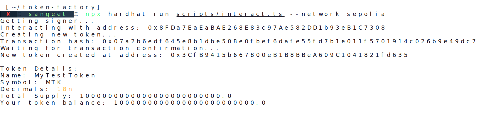

# Token Factory

Create your own ERC20 tokens with custom supply and decimals.

## Getting Started

Drop these in your .env file:
\`\`\`
SEPOLIA_PRIVATE_KEY=your_key_here
INFURA_API_KEY=your_infura_key
\`\`\`

Install stuff:
\`\`\`bash
npm install
\`\`\`

## Quick Deploy

Deploy the factory:
\`\`\`bash
npx hardhat run scripts/deploy.ts --network sepolia
\`\`\`

Make a token:
\`\`\`bash
npx hardhat run scripts/createToken.ts --network sepolia
\`\`\`

## What's Inside

The factory contract lets you create ERC20 tokens. Only people with CREATOR_ROLE can make tokens (this prevents spam).

Factory address on Sepolia: \`0xA61e07d3253eE68c4d2cBf581C70afc2096F8FEA\`

### Creating Tokens

You need:
- Token name 
- Symbol
- Decimals (usually 18)
- Total supply

Example:
\`\`\`typescript
await factory.create_erc20(
  "MyToken",
  "MTK",
  18,
  ethers.parseEther("10000")
);
\`\`\`

### Access Control

- Contract deployer gets admin rights
- Only CREATOR_ROLE can make tokens
- Admins can give CREATOR_ROLE to others

## Common Issues

If you get:
- "account lacks role" → You need CREATOR_ROLE
- "insufficient funds" → Need more Sepolia ETH
- "nonce too high" → Reset Metamask

